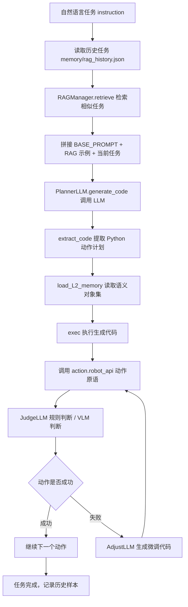

# 系统架构与主流程

本文档说明大脑模块的定位、大小脑分工，以及从自然语言任务到动作执行的完整链路。

## 1. 项目定位

`Big_Brain` 是“大小脑协同的移臂小车精准建图与语义规划技术与系统实现”中的大脑部分。

大脑模块负责“理解任务并组织动作”，包括：

1. 接收自然语言任务。
2. 检索历史相似任务。
3. 调用 LLM 生成高层动作计划。
4. 将自然语言对象描述映射为语义地图中的对象名。
5. 调用动作原语执行导航、抓取、放置。
6. 通过规则和视觉模型判断动作是否成功。
7. 失败时生成局部恢复动作。

小脑模块负责“真实世界执行和感知”，包括：

1. 小车底盘运动控制。
2. 机械臂抓取、放置、复位。
3. 机器人实时位姿、朝向、夹持状态反馈。
4. L3 点云避障建图。
5. L2 语义建图，例如 YOLO + RGBD 深度图生成物体类别、坐标、尺寸、颜色。
6. 动作后图像或传感器观测更新。

## 2. 大脑主流程

入口文件是 `big_brain.py`，核心类是 `BigBrain`。

执行链路：



## 3. 关键设计思想

### 3.1 Code-as-Policy

大脑不是让 LLM 输出 JSON，而是让 LLM 直接输出 Python 动作代码。例如：

```python
desk_obj = parse_obj_name("desk", objects)
move_to_obj_by_offset(desk_obj, 0, 0)
pick_up_obj("bottle")
put_down_obj_by_offset(desk_obj, 0, 0)
```

这样做的优点：

- 可以自然使用变量、循环和中间计算。
- 适合表达路径运动、重复动作、相对位置计算。
- Prompt 中给示例后，模型可以模仿动作编排方式。

风险：

- `exec()` 会执行模型生成代码，接入真实机器人前必须限制可用函数和检查输出。
- Prompt、动作原语和小脑接口必须保持一致。

### 3.2 RAG 历史经验

历史任务保存在 `memory/rag_history.json`。当新任务和历史任务相似度足够高时，会把历史动作代码拼进 Prompt 作为参考。

这能提升规划稳定性，但也要求历史样本必须是正确的，否则会把错误经验传给模型。

### 3.3 语义对象解析

对于“红色方块”“沙发上的杯子”“最左边的椅子”等描述，大脑会调用 `parse_obj_name()`，让 LLM 基于 `objects` 和物体状态查询函数生成筛选代码，并返回对象名。

### 3.4 动作后判断

每个动作原语执行后，`JudgeLLM` 负责判断：

- 规则判断：基于机器人位置、夹持状态、误差阈值。
- 视觉判断：基于动作后图像和全局任务语义。
- 微调恢复：失败后生成局部补救动作。

当前判断闭环是框架状态，真实效果依赖小脑状态接口和动作后图像。

## 4. 当前实现边界

已经落地的部分：

- 大脑主流程。
- PlannerLLM 规划接口。
- RAG 检索框架。
- 对象解析 Prompt。
- 动作原语接口定义。
- VLM 判断 Prompt。
- RoArm-M3 SDK 示例。
- 静态评估脚本。

等待接入的部分：

- `utils.get_obj_xy()`
- `utils.get_obj_z()`
- `utils.get_obj_size()`
- `utils.get_obj_rgb()`
- `utils.get_robot_pos()`
- `utils.get_robot_orientation()`
- `utils.get_robot_arm()`
- `utils.load_L2_memory()`
- 大多数 `action.robot_api` 动作的真实底盘/机械臂调用
- `JudgeLLM.replan()` 中恢复代码实际执行
